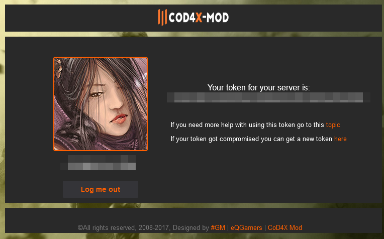
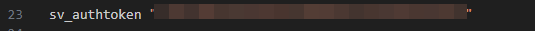
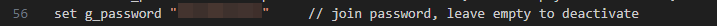
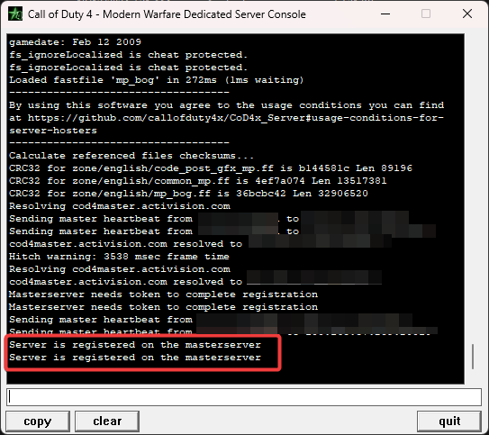

# Cod4x Server for Gaming Gasy Canada

## Setting up a Call of Duty 4 server with Cod4x 1.8 for the gaming group Gaming Gasy Canada
1. Choose a `networkport` that you will use for the server and configure your router to `port forward` that `networkport`. In the following guide, we will use the port `27491`
2. Get a token by visiting the [cod4x server token request link](https://cod4master.cod4x.ovh/index.php?token_generator=true). You will need to sign in with your steam account.
- Please note that your browser will display a security warning when HTTPS-only mode is enabled. You can use HTTP with no security concerns, this is just a verification.
- After signing in to your Steam account (and possibly doing the HTTP bypass), you will be presented with a page containing your token `token` - Please note it

3. Create a directory on your computer where the server files will be stored. In the following, we will use the directory name `cod4xGGCserver`
4. Go to your base cod4 game directory (we will use here the folder `cod4GameFolder` here) and copy all `.iwd` files from the folder `/cod4GameFolder/main/` folder to a `main` folder on `cod4xGGCserver` directory. 
To do this, you can use the following script on Windows but <mark>please adjust the folders beforehand</mark>
```
robocopy ".\cod4GameFolder\main" ".\cod4xGGCserver\main" "*.iwd"
```
5. Also, copy everything in `cod4GameFolder/zone` to `cod4xGGCserver/zone`.
To do this, you can use the following script on Windows but <mark>please adjust the folders beforehand</mark>
```
robocopy ".\cod4GameFolder\zone" .\cod4xGGCserver\zone /S /NFL /R:1 /W:10
```
6. Download the file `cod4x18_dedrun.exe` from [Cod4x server official release](https://github.com/callofduty4x/CoD4x_Server/releases) and put it on the base folder of your server i.e. `cod4xGGCserver`
7. Download the `config.cfg` [file](./files/config.cfg) from this repo and put it on the folder `cod4xGGCserver\main` folder
8. Open the `config.cfg` in a text editor and put the `token` you got from step 1 on the line with `sv_authtoken`.

9.  In the same `config.cfg` file, you will need to set the `g_password` variable to a `password` of your choice.

10. Download the `Cod4x_Server.lnk` [file](./files/Cod4x_Server.lnk) from this repo
11. Open the properties of `Cod4x_Server.lnk` and update the target and start in fields as follows
- Target: you need to set the following arguments in this field
  - `cod4xGGCserver`, the server directory specified in step 3
  - `networkport`, the port you selected in step 1
  - You can tweak this with other arguments, but these are the basics
```
cod4xGGCserver\cod4x18_dedrun.exe +exec config.cfg +set net_port networkport +map mp_crossfire +set dedicated 2 +set sv_punkbuster 0 +set sv_maxclients 32 +map_rotate
```
- Start in: the `cod4xGGCserver` directory. e.g: D:\cod4xGGCserver
12.    Run your shortcut `Cod4x_Server.lnk` as a normal user. Please don't run the server (any server) as root. This would be a huge security risk.
13.    During startup, Windows may prompt you for UAC and firewall permissions. You should see the following screen if everything is set up correctly


## Official links for Cod4x server
[Forums](https://cod4x.ovh) - [Masterserver](http://cod4master.cod4x.ovh/) - [wiki](https://github.com/callofduty4x/CoD4x_Server/wiki)
